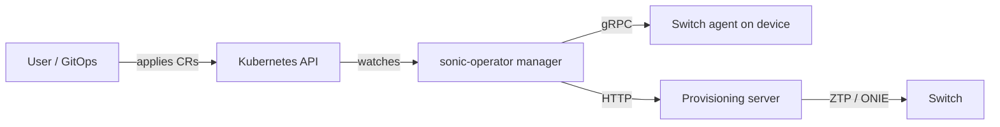

# Architecture

`sonic-operator` is a Kubernetes operator that onboards and manages bare-metal network switches running SONiC.

## Components

- **Controller manager** reconciles CRDs and maintains status.
- **Switch agent** runs on the device and exposes mTLS-secured gRPC operations.
- **Provisioning server** serves ZTP scripts and ONIE artifacts over HTTP.

## High-level flow

1. A `Switch` custom resource represents a physical switch and its endpoint.
2. The controller connects to the agent and observes device state.
3. The controller creates or updates interface resources based on discovery.
4. When writes are explicitly enabled, desired state is applied to the device. By default the controller only observes.

## Diagram

